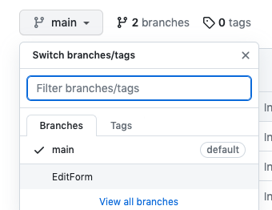
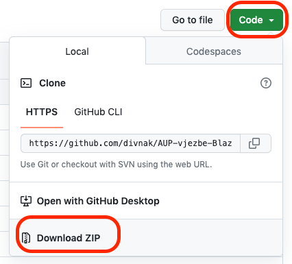

# Blazor primjeri za AUP (2022/23)

.NET 7.0.

Upute:

Ako želite vidjeti primjere za EditForm, odaberite branch EditForm:

<!--  -->


Upute za preuzimanje koda za odabrani "branch":
<!--  -->


## Izrada jednostavne Blazor WebAssembly aplikacije

Novu Blazor WASM aplikaciju stvaramo upisivanjem naredbe u terminal:
```
dotnet new blazorwasm
```

Kompajliranje i provjera:
```
dotnet build
```

Pokretanje aplikacije:
```
dotnet run
```

Drugi način za pokretanje:
```
dotnet watch
```

Važne je zapamtiti:
* CTRL + C (prekid rada)
* CTRL + R (ponovno učitavanje - za watch)
* CTRL + Space (nadopunjavanje koda)

## Preporučene ekstenzije za Blazor

* C# - [ms-dotnettools.csharp](https://marketplace.visualstudio.com/items?itemName=ms-dotnettools.csharp)
* Blazor Snippet Pack - [adrianwilczynski.blazor-snippet-pack](https://marketplace.visualstudio.com/items?itemName=adrianwilczynski.blazor-snippet-pack)

